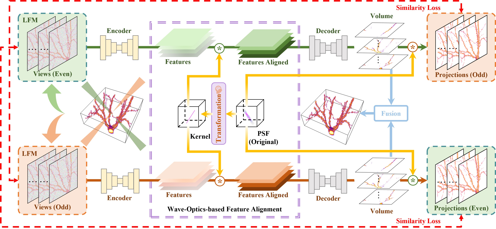

# V2V3D: View-to-View Denoised 3D Reconstruction for Light-Field Microscopy
This is the official repository for our paper: "V2V3D: View-to-View Denoised 3D Reconstruction for Light-Field Microscopy."

Jiayin Zhao, Zhenqi Fu, Tao Yu, Hui Qiao

Tsinghua University & Shanghai AI Laboratory

## Abstract:
Light field microscopy (LFM) has gained significant attention due to its ability to capture snapshot-based, large-scale 3D fluorescence images. However, current LFM reconstruction algorithms are highly sensitive to sensor noise and lack robustness when applied to experimental data. To address these challenges, this paper presents an unsupervised view-to-view LFM 3D reconstruction framework, named V2V3D. Unlike existing methods that directly use all views for reconstruction, V2V3D divides the views into two subsets, with each subset generating corresponding volumes and working together to effectively remove sensor noise. To enhance the recovery of high-frequency details, we propose a novel wave-optics-based feature alignment technique, which transforms the point spread function, used for forward propagation in wave optics, into convolution kernels specifically designed for feature alignment. 
Moreover, we introduce an LFM dataset generated using two-photon excitation, including both the light field images and the corresponding 3D intensity volumes. 
Extensive experiments demonstrate that our unsupervised approach achieves high computational efficiency and outperforms the other state-of-the-art methods. These advancements position V2V3D as a promising solution for 3D imaging under challenging conditions.

  

  

## Code and Dataset
Our code and dataset will be made publicly available soon.
